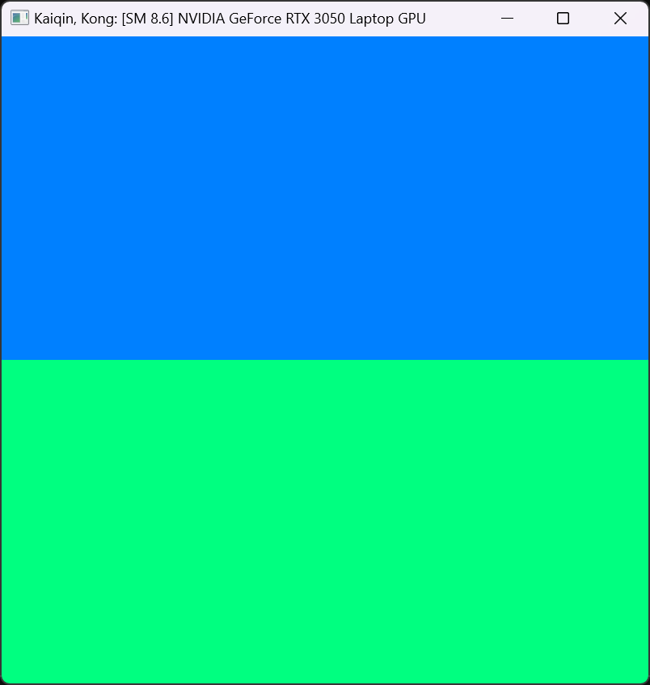
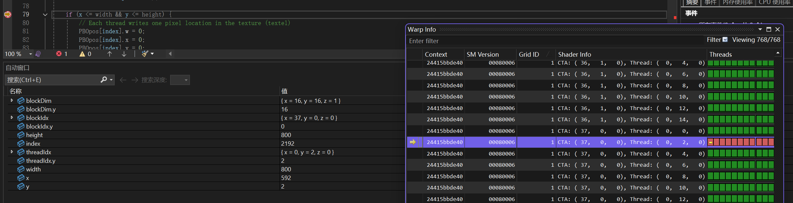
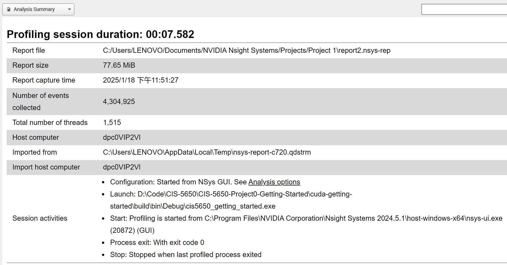
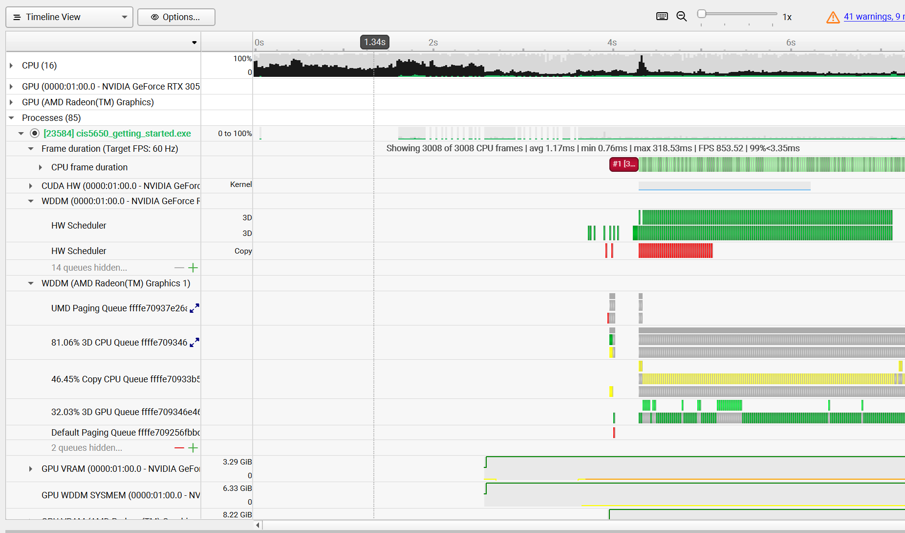
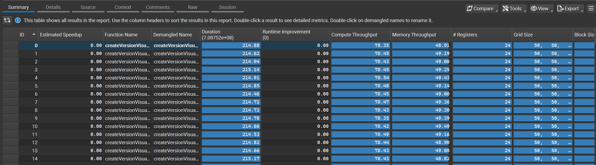
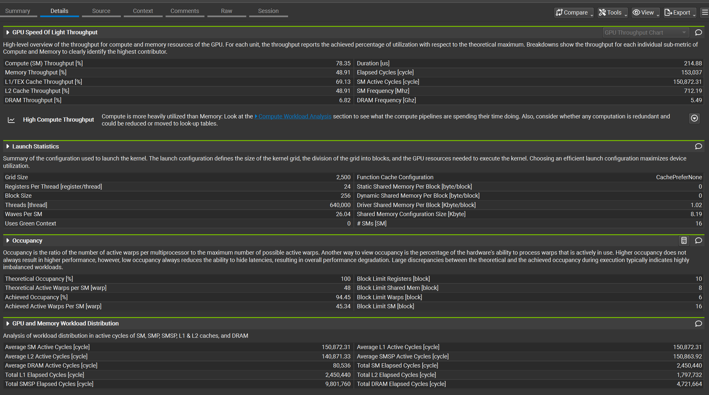
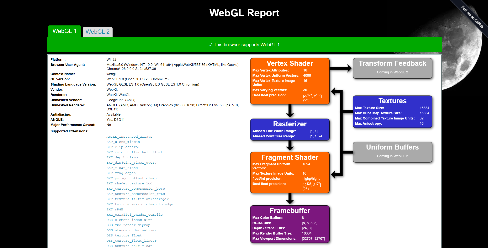
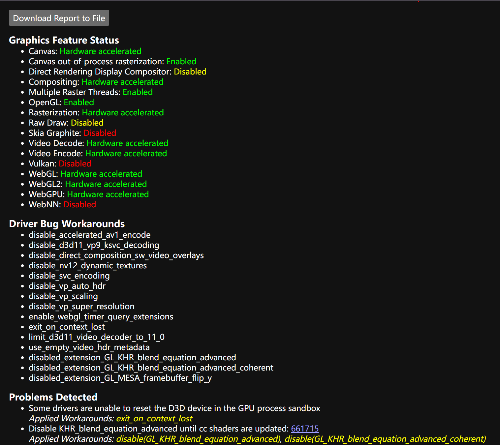
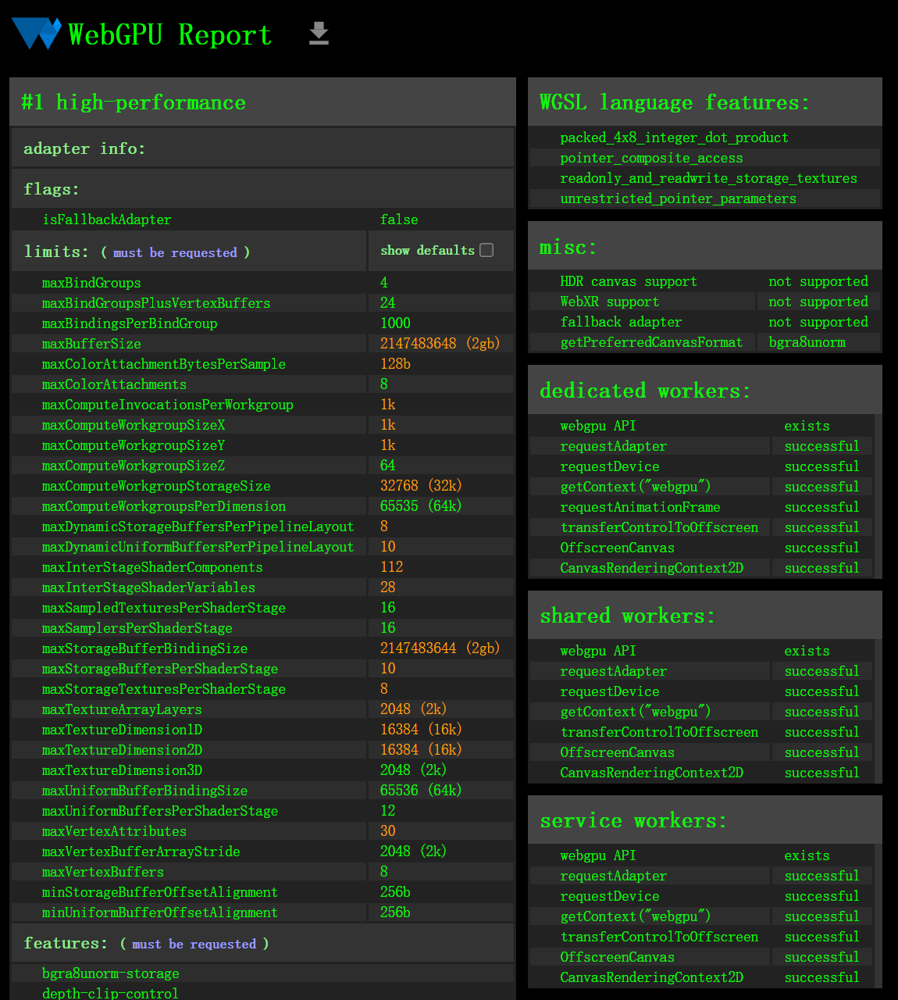

# Project 0 Getting Started

**University of Pennsylvania, CIS 5650: GPU Programming and Architecture, Project 0**

* H1yori233
  * [Github](https://github.com/H1yori233)
* Tested on: Windows 11, AMD Ryzen 7 5800H @ 3.20GHz 16GB, RTX 3050 Laptop 4GB

## Part 2.1

### Part 2.1.1
GPU: NVIDIA RTX 3050 Laptop
Compute Capability: 8.6

### Part 2.1.2

### Part 2.1.3

### Part 2.1.4

### Part 2.1.5

## Part 2.2

## Part 2.3

